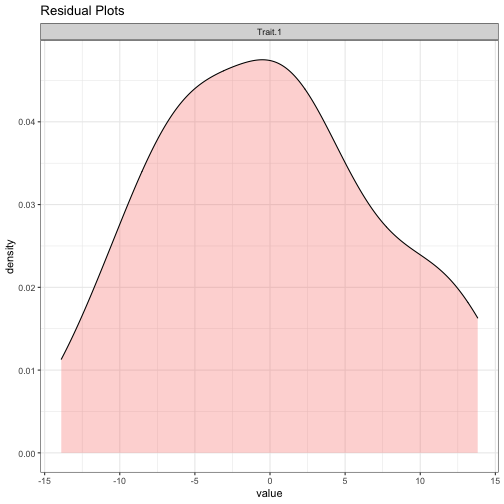
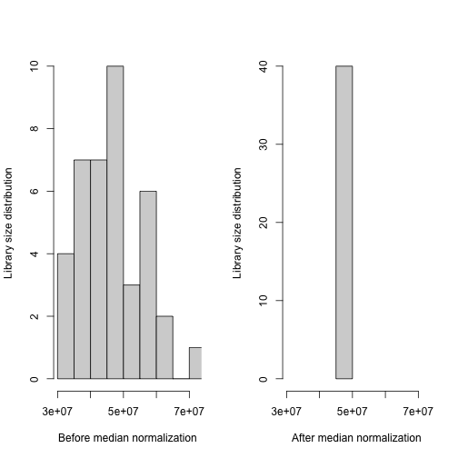
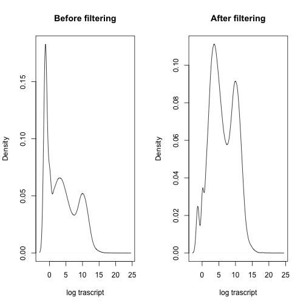
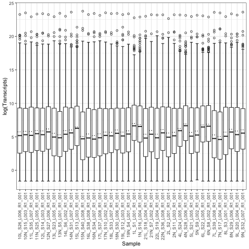
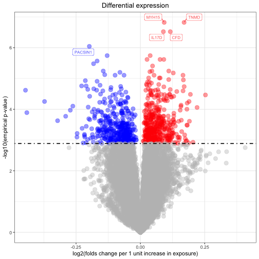
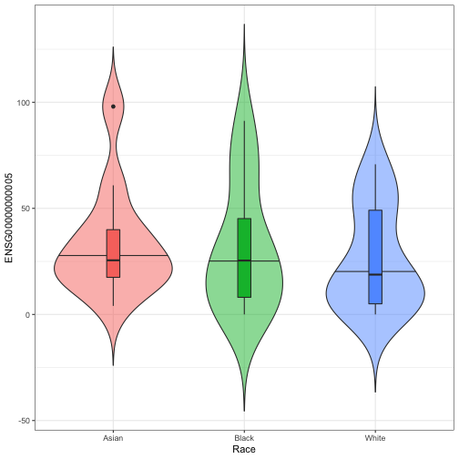

# Introduction
Here we demonstrate how to perform association analyses of continuous phenotypes using the Olivia package with RNA-seq data based on the pipeline proposed in the manuscript ``Benchmarking Association Analyses of Continuous Exposures with RNA-seq in Observational Studies``https://www.biorxiv.org/content/10.1101/2021.02.12.430989v1.abstract. 

[Click here for instructions on using Olivia as a Shiny app.](#running-olivia-using-an-R-Shiny-app)

# Installation and required packages

To install, open R and type:

```r
library("devtools")
install_github("nkurniansyah/Olivia")
library(Olivia)
```

Olivia requires external packages from CRAN (dplyr, ggplot2, tableone, reshape, and ggrepel) and Bioconductor(qvalue)


```r
install.packages("dplyr")
```

Load packages


```r
library(dplyr)
library(ggplot2)
library(reshape2)
library(tableone)
library(ggrepel)
library(EnsDb.Hsapiens.v86)
```

# Load example data

## Load raw gene counts matrix 
First we load the transcripts. The transcripts were obtained from https://www.ncbi.nlm.nih.gov/geo/query/acc.cgi?acc=GSE151243. 
Note: we reformatted the transcript matrix into desired form and embedded them into the Olivia package.


```r
data(rnaseq_count_matrix)
rnaseq_count_matrix[1:5,1:5]
```

```
##                 10L_S26_L006_R1_001 10N_S15_L003_R1_001 11L_S35_L007_R1_001 11N_S25_L005_R1_001 12L_S14_L003_R1_001
## ENSG00000000003                 446                 644                 525                 701                 572
## ENSG00000000005                   5                  19                   2                  64                  25
## ENSG00000000419                 883                1058                 609                 547                 576
## ENSG00000000457                 790                1009                 619                 887                 650
## ENSG00000000460                 206                 289                 272                 214                 334
```

## Load simulated phenotypes
We simulated in advance a data.frame of phenotypes. 


```r
data(phenotype)
head(phenotype)
```

```
##                     Age Sex  Trait.1  Trait.2  Race
## 10L_S26_L006_R1_001  18   1 16.06608 15.58321 White
## 10N_S15_L003_R1_001  19   0 21.20045 20.61345 Asian
## 11L_S35_L007_R1_001  20   0 14.44867 13.88567 Black
## 11N_S25_L005_R1_001  21   0 35.89606 34.84859 White
## 12L_S14_L003_R1_001  22   1 24.09078 24.42536 Asian
## 12N_S27_L006_R1_001  21   1 29.61045 26.62854 Asian
```

## Summarize phenotypes

We create a table summarizing the phenotypes.


```r
summary_phen<- summarize_phenotypes(pheno = phenotype,
                                    categorical_variables = c("Sex"),
                                    numeric_variables = c("Age","Trait.1","Trait.2"),
                                    strata = "Race")
```

```
## Generate summary of phenotype using Sex Age Trait.1 Trait.2
```

```r
summary_phen
```

```
##                      Stratified by Race
##                       Asian         Black         White        
##   n                      11            12            17        
##   Sex = 1 (%)             6 (54.5)      4 (33.3)     10 (58.8) 
##   Age (mean (SD))     37.00 (13.67) 35.83 (11.14) 37.82 (11.41)
##   Trait.1 (mean (SD)) 26.62 (5.17)  24.36 (8.88)  25.40 (8.04) 
##   Trait.2 (mean (SD)) 26.14 (4.97)  24.18 (8.77)  25.89 (8.25)
```


We define the trait of interest to study as an exposure associated with genes. The trait/phenotype has to correspond to a column name in the phenotype data.frame.


```r
trait <- "Trait.1"
```

We will adjust our analysis to the simulated covariates Age and Sex. The covariates have to correspond to column names in the phenotype data.frame. In the analysis, we will use a string defining the regression model (just the covariates part of it), so we define it here: 


```r
covariates_string <- "Age + Sex"
```

Note that we can also define the string to be "Age + as.factor(Sex)", or use interaction terms, like one would use in regression functions in R. 


Match the (simulated) individuals between the phenotype and the RNA-seq count matrix. Make sure the there are matching IDs.

```r
IDs_both <- intersect(rownames(phenotype), colnames(rnaseq_count_matrix))
rnaseq_matrix <- rnaseq_count_matrix[, IDs_both] 
phenotypes <- phenotype[match(IDs_both,rownames(phenotype)),]
```


## Residual plot of the trait

After defining the trait of interest and covariates to adjust to the model, it is helpful to look at the trait's residual distribution.


```r
resid_plot<- residual_plot(pheno = phenotype, 
                           traits = trait,
                           covariates_string = covariates_string)
```

```
## Generate residual of Trait.1...
```

```
## Generate the residual plot...
```

```r
resid_plot
```



Here, the residuals' distribution has short tails. 

# Normalize the RNA-seq dataset

We use median normalization in Olivia to reduce package dependencies. However, users can use different normalization method using different packages, for example: estimateSizeFator(DESeq2) or TMM(edgeR). There are no downstream differences in how the methods are applied once the data is normalized. 


## Median normalization
After median normalization, the sum of the gene expression values over all transcripts is the same across individuals. 

```r
median_norm <- median_normalization(rnaseq_matrix)

xrange <- range(colSums(rnaseq_matrix))
par(mfrow = c(1,2))
hist(colSums(rnaseq_matrix), 
     xlim = xrange, 
     main = "",
     xlab = "Before median normalization",
     ylab = "Library size distribution")
hist(colSums(median_norm), 
     xlim = xrange, 
     main = "",
     xlab = "After median normalization",
     ylab = "Library size distribution")
```




# Filtering transcripts

Remove lowly expressed genes


```r
clean_count_matrix <- apply_filters(count_matrix = median_norm, 
                                    median_min = 1, 
                                    expression_sum_min = 10, 
                                    max_min = 10, 
                                    range_min = 5, 
                                    prop_zero_max = 0.5)
```

```
## applying filters on a transcript count matrix of 58051 transcripts, across 40 individuals
```

```
## Computing transtripts characteristics...
```

```
## Appying filters...
```

```
## There are 23987 transcripts with median
##                   value lower than 1
```

```
## There are 14190 transcripts with expression sum
##                   value lower than 10
```

```
## There are 22297 transcripts with maximum expression
##                   value lower than 10
```

```
## There are 17188 transcripts with maximum
##                   expression range value lower than 5
```

```
## There are 21923 transcripts with propotion
##                   of zero counts higher than 0.5
```

```
## Removing 24834 unique transcripts not passing requested filters
```


After filtering genes, there are 33217 remaining for differential expression analysis. The plot below illustrates the proportion of transcripts/genes in the “12N_S27_L006_R1_001” sample (selected randomly) before and after filtering.


```r
par(mfrow=c(1,2))
plot(density(log_replace_half_min(median_norm)[,"12N_S27_L006_R1_001"]),
     main="Before filtering", xlab="log trascript")
plot(density(log_replace_half_min(clean_count_matrix)[,"12N_S27_L006_R1_001"]), 
     main="After filtering", xlab="log trascript")
```




The figure below shows the distribution of transcript expressions (counts) in the sample in boxplots after filtering and after log transformation. 


```r
log_counts<- log_replace_half_min(clean_count_matrix)
log_counts<-melt(log_counts)

box_plot<- ggplot(log_counts, aes(x = Var2, y = value)) + 
                  stat_boxplot(aes(Var2, value), 
                  geom='errorbar', linetype=1, width=0.5)+ 
                  xlab("Sample")+ 
                  ylab("log(Transcripts)")+ 
                  geom_boxplot( aes(Var2, value),outlier.shape=1)+
                  stat_summary(fun = mean, geom = "errorbar", 
                                aes(ymax = ..y.., ymin = ..y..),
                                width = .75, linetype = "dotted") +
                 theme_bw()+
                 theme(axis.text.x = element_text(angle = 90, vjust = 0.5, hjust=1))
  
box_plot
```



# Perform transcriptome-wide association study

We show how we perform differential expression analysis (Transcriptome-wide association study) on all transcripts using empirical p-value (quantile empirical p-values). To generate p-values under the null, we create a ``residual permuted`` trait 100 times, perform differential expression analysis, and use the resulting p-values as our null p-values. However, users also can implement Storey empirical p-value (as these are referred to in the manuscript) using test statistics.


```r
set.seed(12)

quantile_emp_trascript<-lm_count_mat_emp_pval(clean_count_matrix, 
                                              pheno=phenotypes, 
                                              trait=trait,
                                              covariates_string=covariates_string,
                                              n_permute=100,
                                              log_transform = "log_replace_half_min",
                                              outcome_type ="continuous",
                                              gene_IDs=NULL)
```

```
## Performing residual permutation to generate permuted trait...
```

```
## performing differential expression analysis on 100 permuted traits
```

```
## Computing quantile empirical p-values
```

## Add annotation

We do not implement the annotation feature into the Olvia package, to limit chances to run into compatibility issues as packages update. We here demonstrate how to create a function to add an annotation in a transcriptome-wide association study. We use  [EnsDb.Hsapiens.v86](http://bioconductor.org/packages/release/data/annotation/html/EnsDb.Hsapiens.v86.html)


```r
add_annotation<-function(deg_res){
  
   gene_symbol<- select(EnsDb.Hsapiens.v86, 
                        keys =as.character(deg_res$geneID) ,
                        keytype = "GENEID",
                        columns = c("GENEID", "GENENAME"))
   
   colnames(gene_symbol)<- c("geneID","geneName")
   
   annot_deg<-left_join(deg_res,gene_symbol, by="geneID")
   annot_deg<- annot_deg %>% dplyr::rename(IDs=geneID,
                                           geneID= geneName)
   return(annot_deg)
   
}
```


```r
quantile_emp_trascript <- add_annotation(quantile_emp_trascript)
head(quantile_emp_trascript)
```

```
##               IDs     adjLogFC          se     t_stat t_stat_df      p_value      fdr_bh    emp_pvals bh_emp_pvals   geneID
## 1 ENSG00000000003  0.017357492 0.010049207  1.7272499        36 9.269483e-02 0.369384496 1.019728e-01   0.40635317   TSPAN6
## 2 ENSG00000000005  0.169923122 0.024726980  6.8719723        36 4.835620e-08 0.001606248 1.505253e-07   0.00250000     TNMD
## 3 ENSG00000000419  0.002683873 0.014082843  0.1905775        36 8.499273e-01 0.954520056 8.552118e-01   0.96045199     DPM1
## 4 ENSG00000000457  0.006484793 0.009770087  0.6637395        36 5.110857e-01 0.812322708 5.245516e-01   0.83372554    SCYL3
## 5 ENSG00000000460 -0.017100775 0.012268212 -1.3939093        36 1.718902e-01 0.505504776 1.841322e-01   0.54149836 C1orf112
## 6 ENSG00000000938 -0.074471226 0.019795282 -3.7620695        36 5.999232e-04 0.030517578 8.275883e-04   0.04205167      FGR
```


Now, we can obtain significant genes (the genes which have bh_emp_pvals < 0.05)


```r
tophits <- quantile_emp_trascript[which(quantile_emp_trascript$bh_emp_pvals< 0.05),]
head(tophits)
```

```
##                 IDs    adjLogFC          se    t_stat t_stat_df      p_value      fdr_bh    emp_pvals bh_emp_pvals   geneID
## 2   ENSG00000000005  0.16992312 0.024726980  6.871972        36 4.835620e-08 0.001606248 1.505253e-07   0.00250000     TNMD
## 6   ENSG00000000938 -0.07447123 0.019795282 -3.762069        36 5.999232e-04 0.030517578 8.275883e-04   0.04205167      FGR
## 12  ENSG00000001461  0.03820379 0.009127139  4.185735        36 1.747104e-04 0.023064772 2.146491e-04   0.02840637   NIPAL3
## 107 ENSG00000005844 -0.07031756 0.017600485 -3.995206        36 3.057323e-04 0.025733375 3.991932e-04   0.03382278    ITGAL
## 116 ENSG00000006016  0.08467400 0.020904358  4.050543        36 2.600651e-04 0.024333821 3.287473e-04   0.03076056    CRLF1
## 123 ENSG00000006118 -0.08471630 0.021090465 -4.016806        36 2.870448e-04 0.025225994 3.730018e-04   0.03271768 TMEM132A
```
## Visualize up-regulated and down-regulated transcripts
After completing the transcriptome-wide association study, now we can visualize up-regulated and down-regulated genes using a volcano plot.


```r
volcano <- volcano_plot(deg_res = quantile_emp_trascript,
                        significant_threshold = 0.05 )
```

```
## Generate volcano plot..
```

```r
volcano
```



## Violin plot
Looking at the results, we may want to see how a transcript of interest (e.g. the most significantly-associated gene) distributes across population strata. We here visualize this using violin plots. The row names in the matrix of transcript counts and in the phenotype matrix have to match.


```r
top_gene<- "ENSG00000000005" 
violin_plot(pheno = phenotypes,
            strata = "Race",
            norm_count_matrix  = clean_count_matrix,
            selected_transcript = top_gene)
```

```
## Generate violin plot for ENSG00000000005 and stratified by Race
```



# Perform association analysis for selected gene/s


When testing only a handful of genes, we may not want to perform a transcriptome-wide association analysis. Therefore, empirical p-values using the quantile or Storey's approach cannot be computed (not enough tests to generate the null distribution). Instead, we permute specific genes many times. 
Here we show how to perform differential expression analysis on selected transcripts when computing a permutation p-value for each gene based on permutations for this gene only. We suggest running 100000 permutations, but more permutation are needed if higher precision in p-value computation is needed.


```r
set.seed(12)

gene_names<-sample(rownames(clean_count_matrix),3)

perm_res<- lm_count_mat_perm_pval(count_matrix=clean_count_matrix,
                                  pheno=phenotypes,
                                  trait=trait, 
                                  covariates_string=covariates_string,
                                  n_permute=100000,
                                  gene_IDs=gene_names,
                                  seed = NULL,
                                  log_transform = "log_replace_half_min",
                                  outcome_type ="continuous")
```

```
## Filtering count_matrix to genes : ENSG00000211888 ENSG00000100416 ENSG00000039650
```

```
## Performing residual permutation to generate permuted trait...
```

```r
perm_res<-add_annotation(perm_res)

head(perm_res)
```

```
##               IDs     adjLogFC         se    t_stat t_stat_df     p_value perm_pval geneID
## 1 ENSG00000211888 -0.112482869 0.03583958 -3.138510        36 0.003381306   0.00335  TRAJ1
## 2 ENSG00000100416 -0.009668082 0.01282077 -0.754095        36 0.455696677   0.45678   TRMU
## 3 ENSG00000039650 -0.026389697 0.01027976 -2.567152        36 0.014554899   0.01258   PNKP
```


# Perform transcriptome-wide association study for multiple exposures


We show how we perform differential expression analysis on all transcripts using emprical p-value(quantile empirical p-values) when testing association using multiple exposure at the same time. 


```r
set.seed(12)

quantile_emp_multi<-lm_mult_count_mat_emp_pval(clean_count_matrix, 
                                               pheno=phenotypes, 
                                               traits=c("Trait.1","Trait.2") ,
                                               covariates_string=covariates_string,
                                               n_permute=100,
                                               gene_IDs=NULL,
                                               log_transform = "log_replace_half_min", 
                                               outcome_type="continuous")
```

```
## Performing residual permutation to generate permuted trait...
```

```
## performing differential expression analysis on 100 permuted traits
```

```
## Computing quantile empirical p-values
```

```r
quantile_emp_multi<-add_annotation(quantile_emp_multi)
head(quantile_emp_multi)
```

```
##               IDs adjLogFC_Trait.1 adjLogFC_Trait.2 chisq_stat chisq_stat_df      p_value       fdr_bh    emp_pvals bh_emp_pvals
## 1 ENSG00000000003      -0.10675797       0.12623124  5.9029877             2 5.226158e-02 2.498162e-01 7.272601e-02    0.3476385
## 2 ENSG00000000005       0.41402432      -0.24826235 49.8933559             2 1.464858e-11 4.865818e-07 1.505253e-07    0.0050000
## 3 ENSG00000000419      -0.15522792       0.16060370  2.2915987             2 3.179696e-01 6.034386e-01 3.439989e-01    0.6528065
## 4 ENSG00000000457      -0.03785637       0.04509704  0.7829863             2 6.760467e-01 8.458419e-01 6.945609e-01    0.8690008
## 5 ENSG00000000460      -0.11979076       0.10444052  3.1761359             2 2.043200e-01 4.921484e-01 2.311103e-01    0.5566630
## 6 ENSG00000000938      -0.05065862      -0.02421854 13.7940006             2 1.010813e-03 3.432332e-02 3.668001e-03    0.1243249
##     geneID
## 1   TSPAN6
## 2     TNMD
## 3     DPM1
## 4    SCYL3
## 5 C1orf112
## 6      FGR
```


Now, we can identify significantly-associated genes based on transcriptome-wide associations using multiple exposures (the genes which have bh_emp_pvals < 0.05)


```r
top_emp_multi<-quantile_emp_multi[quantile_emp_multi$bh_emp_pvals< 0.05,]
rownames(top_emp_multi)<-NULL

head(top_emp_multi)
```

```
##               IDs adjLogFC_Trait.1 adjLogFC_Trait.2 chisq_stat chisq_stat_df      p_value       fdr_bh    emp_pvals bh_emp_pvals geneID
## 1 ENSG00000000005        0.4140243     -0.248262354   49.89336             2 1.464858e-11 4.865818e-07 1.505253e-07   0.00500000   TNMD
## 2 ENSG00000144821        0.1005357     -0.008144529   39.42639             2 2.745790e-09 4.560345e-05 1.204203e-06   0.02000000  MYH15
## 3 ENSG00000197766        0.2948484     -0.181672393   36.53264             2 1.166911e-08 1.292043e-04 3.311557e-06   0.03666667    CFD
```


# Running Olivia using an R Shiny app

Olivia is available as a Shiny app. This app will run locally on your computer using gist.github.com to avoid potential memory problems when users try to run an analysis using large samples and transcripts/gene counts.

To run Olivia's shiny app, users need to have R/4.0.0 or above installed. Also, users need to install few R packages and load them before running the app. 

# Example files (optional)
You can download the example files from the tutorial on the Shiny app. Alternatively, you can install the Olivia R package, and save the example files as follows:

```{r, eval = FALSE}
library(Olivia)
write.table(get(data("rnaseq_count_matrix")), file = "rnaseq_count_matrix.txt", quote = FALSE)
write.csv(get(data("phenotype")), file = "phenotypes.csv")
```

Please run the R code below before every use of the Olivia Shiny app.


```r


# CRAN
install_cran_package <- function(pkg){
  new.pkg <- pkg[!(pkg %in% installed.packages()[, "Package"])]
  if (length(new.pkg)) 
    install.packages(new.pkg, dependencies = TRUE)
  sapply(pkg, library, character.only = TRUE)
}

list_packages_cran <- c("shiny","progress","shinyjs","shinythemes","scales",
                      "kableExtra","gridExtra","shinyFiles","DT","grid","data.table",
                      "plyr","tableone","reshape","BiocManager","ggrepel","dplyr","tidyverse")

install_cran_package(list_packages_cran)


# Bioconductor
install_bioconductor_package <- function(pkg){
  new.pkg <- pkg[!(pkg %in% installed.packages()[, "Package"])]
  if (length(new.pkg)) 
    BiocManager::install(new.pkg, dependencies = TRUE)
  sapply(pkg, library, character.only = TRUE)
}

list_packages_bioconductor <- c("EnsDb.Hsapiens.v86","fgsea")

install_bioconductor_package(list_packages_bioconductor)


# Run shiny:

shiny::runGist("ca33e0b4099ef0ca6330740a6b98be83")


```


